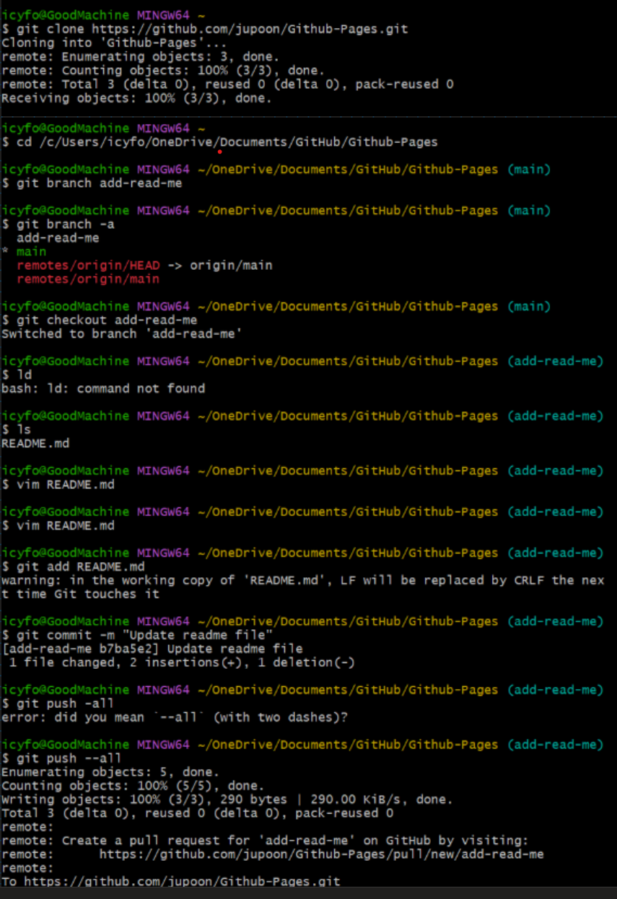
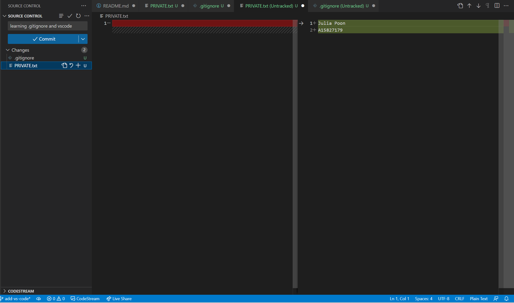

# CSE 110: Software Engineering
## Julia Poon
### LAB 1: VSCode, Markdown, and Git Part 1

**Hello, my name is Julia. Welcome to my Github page :) You may read my basic introduction [here](https://github.com/jupoon/Github-Pages/edit/main/index.md#introduction). Read about what I did for this lab [here](https://github.com/jupoon/Github-Pages/edit/main/index.md#lab-1)**

As a wise philospher once said, 
>*Everyone's undefeated until they aren't*  
> \-[Ryan Bergara, "Buzzfeed Unsolved"](https://buzzfeed-unsolved.fandom.com/wiki/Ryan_Bergara)

#### Introduction
I am a 4th year Economics & Political Science double major minoring in Computer Science. I am from Seattle, WA. 

I am proficient in Java, C++, and the statistical computing language R. Here are the CSE courses I have already taken before:
- CSE 11
- CSE 12 & 15L
- CSE 20
- CSE 21
- CSE 30
- CSE 100
- CSE 101
- CSE 105

#### Lab 1

Tasks:
- [X] Part 1: Installing Visual Studio Code and Extensions
- [X] Part 2: Refamiliarizing Ourselves with Git
- [X] Part 3: Markdown

**PART 1**

The task was to download VSCode + Extensions. I have done that 👍

**PART 2**

The tasks I had to do were related to Github and various platforms I could access and use it from. The tasks I had to complete were:
1. Command Line Operations
2. VSCode UI & .gitignore

*Command Line Operations*

For this task, we had to execute a series of command line operations. As you can see in the screenshot below, I used git bash to execute the following commands:
- `git clone`
- `cd`
- `vim` to edit the [README.md file](README.md)
- `git add`
- `git commit`
- `git push`

*VSCode UI & .gitignore*

Attached is my screenshot of my staged commit in VSCode, where I created my .gitignore file that includes PRIVATE.txt

**PART 3**

Part 3 is where I had to create an index.md file and include the Markdown constructs from the list below:
- Headings
- Styling text
- Quoting text
- Quoting code
- External Links
- Section links
- Relative links (Link to another .md file or an image in your repo. If linking to an image, encode it as a regular link rather than an image.)
- Ordered and Unordered Lists
- Task lists
- Images

Surprise! Part 3 is this entire page. Now I'm finished with Lab 1!

**Thanks for reading!**

